Repositorio con el código de:
Prueba / módulo 4 llamado **"Programación avanzada en JavaScript"** de la beca **"Desarrollo de aplicaciones Full Stack Javascript Trainee"** dictado por Desafío Latam.

<h1>REQUISITOS</h1> 

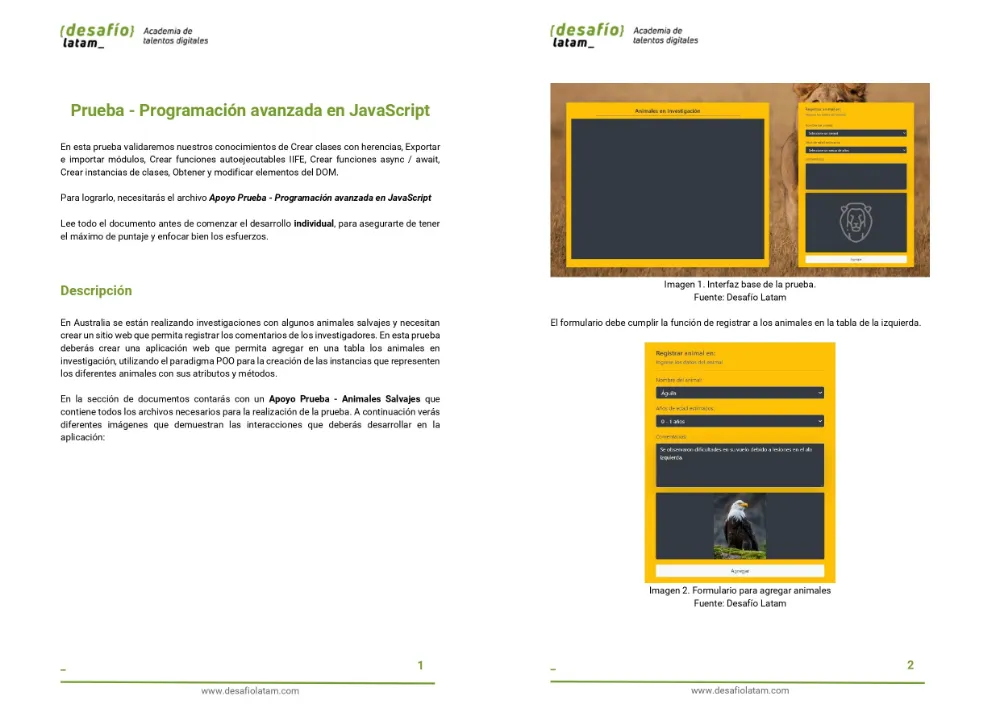
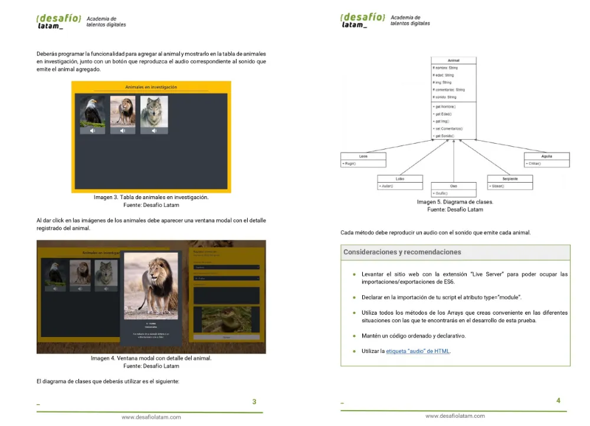
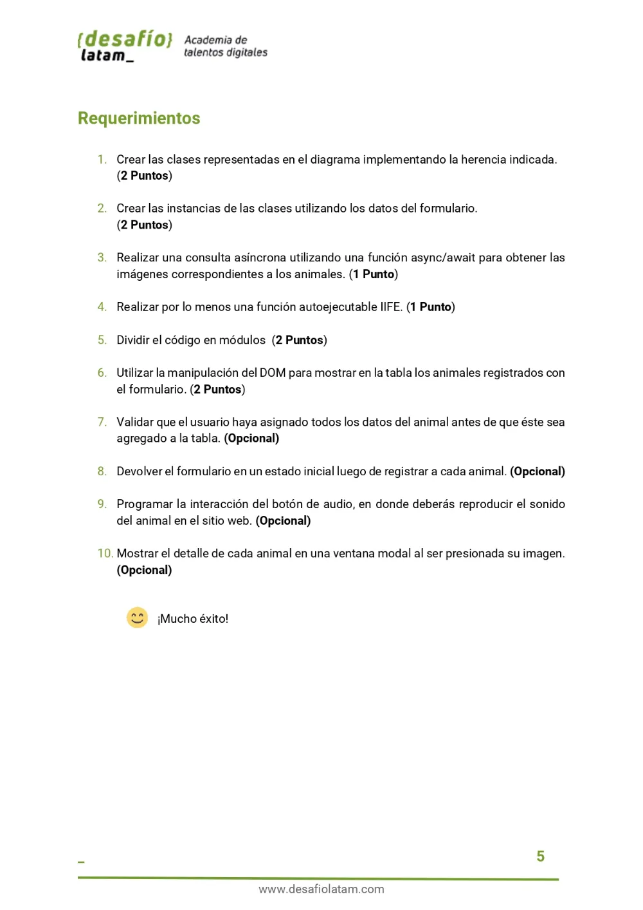

PASO a PASO DE LOS **REQUISITOS**:

### 1. Crear clases representadas en el diagrama implementando su herencia indicada:

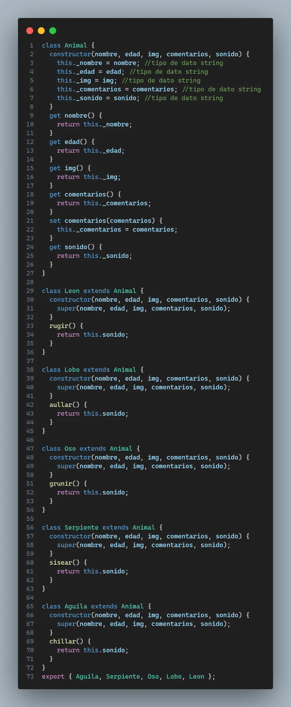

### 2. Crear instancias de las clases utilizando los datos del formulario.

Creo la instancia una vez que recibo la data del formulario de manera dinámica como muestro en la línea 5:

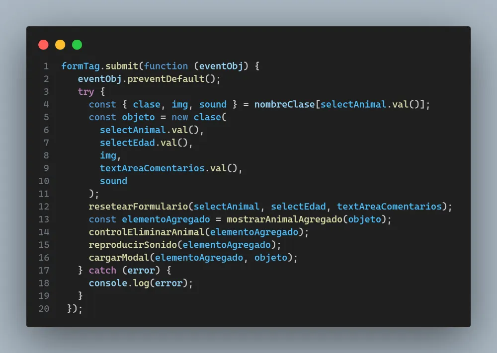

### 3. Realizar una consulta asíncrona utilizando una función async/await para obtener las imágenes correspondientes a los animales:

Realizo una IIFE [Immediately Invoked Function Expression] que hace fetch a la data almacenada en el archivo **animales.json**. 

Luego de cargada la data, procedo a almacenarla en una variable global.
La variable global se utiliza para crear un objeto que posee la **clase respectiva** a la que pertenece el animal y esta clase se usa para crear la instancia.

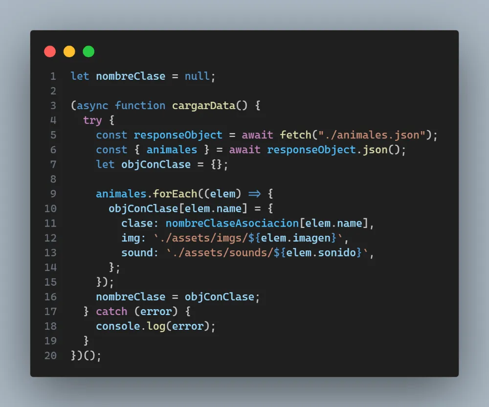

### 4. Realizar por lo menos una función autoejecutable IIFE

El código en el punto 3 anterior es IIFE

### 5. Dividir el código en módulos

Archivo **modulos.js** el cual posee todas las clases para luego exportarlas y crear objetos en el archivo **script.js**

### 6. Utilizar la manipulación del DOM para mostrar en la tabla los animales registrados con el formulario.

Para mostrar el animal en el canvas izquierdo se crea la función **mostrarAnimalAgregado** la cual posee como parámetro el objeto creado al completar los campos del formulario y al hacer click en el botón **Agregar** del formulario.

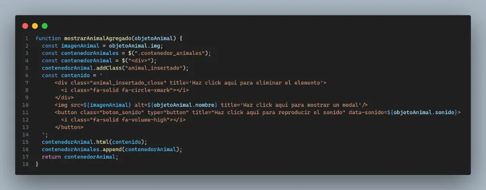

### 7. Validar que el usuario haya asignado todos los datos del animal antes de que éste sea agregado a la tabla. (Opcional)

Se aplica validación en html no permitiendo el ingreso de valores en blanco ya sea en 'los select' y en el 'textarea' vía atributo **required**

### 8. Devolver el formulario en un estado inicial luego de registrar a cada animal. (Opcional)

Para resetear formulario se crea la función **resetearFormulario** la cual presenta como parámetros los input del formulario los cuales luego sus valores son configurados a una cadena vacía

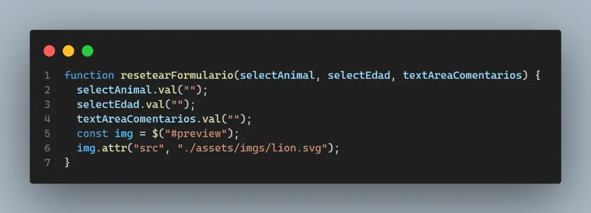

### 9. Programar la interacción del botón de audio, en donde deberás reproducir el sonido del animal en el sitio web. (Opcional)

Para reproducir audio de cada animal he creado la función **reproducirSonido**:

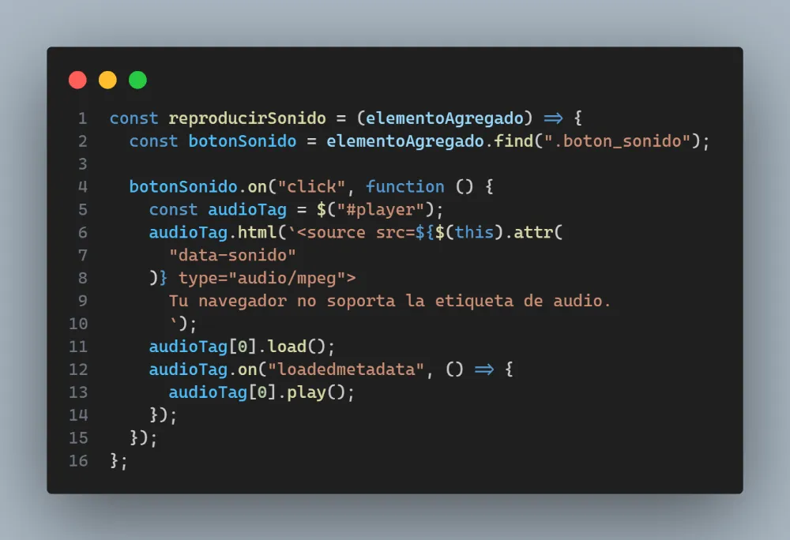

### 10. Mostrar el detalle de cada animal en una ventana modal al ser presionada su imagen. (Opcional)

función **cargarModal** para mostrar Modal, es el siguiente:

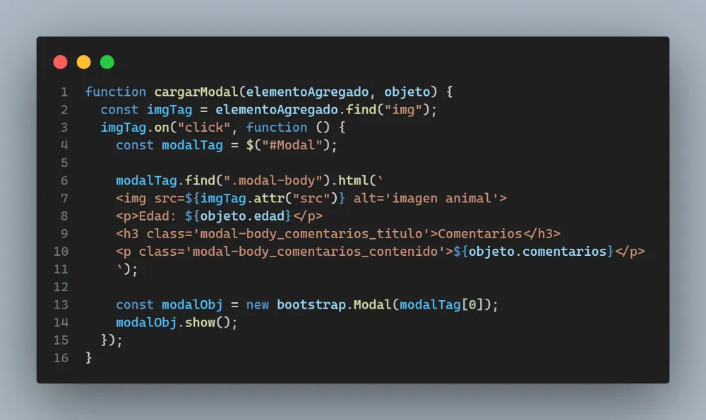

Modal operando:

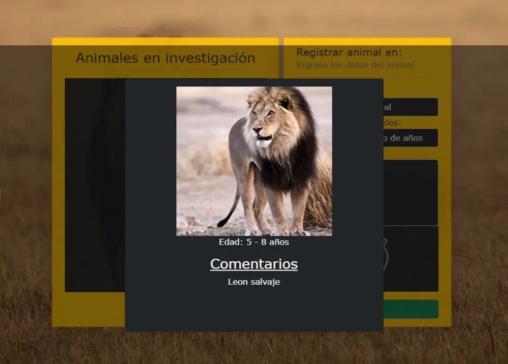

Funcionalidad para eliminar los elementos ya agregados al canvas, con la función **controlEliminarAnimal**:

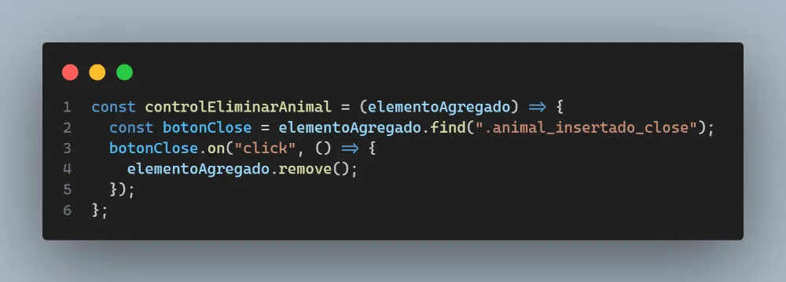
